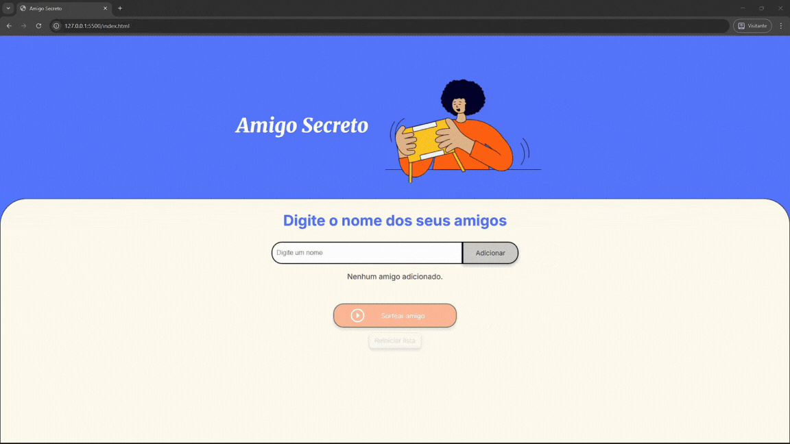

# Amigo Secreto

Aplicação simples para gerenciar uma lista de participantes e sortear o "amigo secreto". Feita em HTML, CSS e JavaScript — com persistência via localStorage, edição inline dos nomes e modal de confirmação para remoção e reinício.

## Demo
  

---

## Funcionalidades

- Adicionar nomes à lista (validação para campo vazio).
- Evita nomes duplicados (case-insensitive).
- Listagem dinâmica com botões Editar e Remover por item.
- Edição inline (sem prompt), com salvar/cancelar e validações.
- Modal de confirmação customizado para remoção e reinício.
- Persistência no navegador via localStorage.
- Botão para sortear amigo de forma aleatória.
- Botões habilitados/desabilitados conforme estado da lista.

## Estrutura do projeto

- index.html — marcação da aplicação
- css/styles.css — estilos e responsividade
- js/script.js — lógica (adicionar, editar, remover, sortear, modal, persistência)
- assets/ — imagens e GIFs usados no README e interface

## Como executar (local)

1. Abra a pasta do projeto no VS Code ou outro editor.
2. Abra `index.html` no navegador (duplo clique) ou sirva com um servidor estático:
   - Com Python 3:
     - cd amigo-secreto
     - python -m http.server 8000
     - Acesse http://localhost:8000
     - Ou utiliza a extensão Live Server no VS Code
3. Use a interface para adicionar/editar/remover nomes e testar o sorteio.

## Boas práticas de git (mensagens sugeridas)

- chore: commit inicial
- feat: adicionar persistência via localStorage
- feat: implementar edição inline e modal de confirmação
- fix: corrigir validação de duplicatas
- docs: atualizar README

## Contribuição

1. Crie uma branch de feature: `git checkout -b feat/minha-funcionalidade`
2. Faça commits pequenos e descritivos (seguir Conventional Commits em português).
3. Abra um pull request para revisão.

## Licença

MIT — veja o arquivo LICENSE (se necessário, crie um arquivo LICENSE com o texto MIT).

